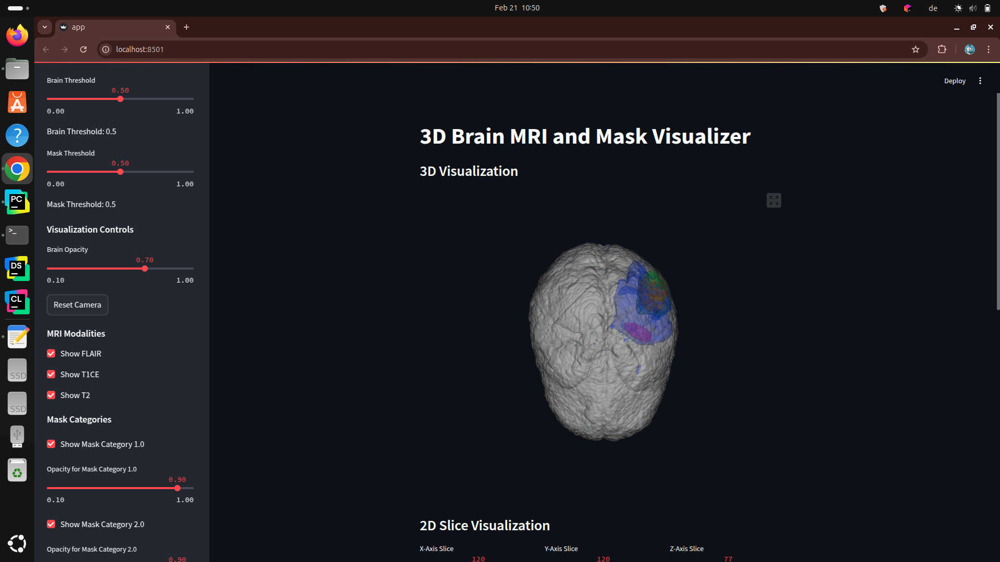
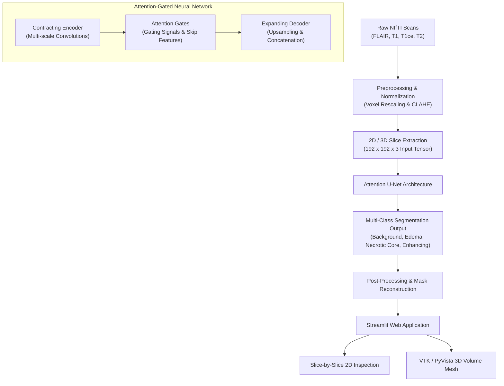

# 🧠 NeuroSeg: 3D Brain Tumor Segmentation & Interactive Web Visualization

[](https://www.python.org/)
[](https://tensorflow.org/)
[](https://streamlit.io/)
[](https://pyvista.org/)
[](LICENSE)

An end-to-end deep learning framework for automated multi-modal brain tumor segmentation and 3D volumetric visualization using an **Attention U-Net** on the **BraTS 2020 (Brain Tumor Segmentation Challenge)** dataset.

---

## 📌 Overview

Gliomas are among the most aggressive brain malignancies. Accurate segmentation of sub-tumoral structures (edema, necrotic core, and enhancing tumor) is essential for surgical planning, radiotherapy, and longitudinal monitoring.

**NeuroSeg** addresses this clinical need through:
1. **Multi-Modal MRI Processing:** Harmonizes FLAIR, T1, T1ce (contrast-enhanced), and T2 sequences.
2. **Adaptive Contrast Enhancement:** Integrates CLAHE (Contrast Limited Adaptive Histogram Equalization) to reveal subtle lesion boundaries.
3. **Attention-Gated U-Net:** Employs spatial attention mechanisms that suppress irrelevant background tissue and highlight pathologically salient features.
4. **Interactive 3D Web Platform:** An intuitive Streamlit interface powered by VTK marching cubes and PyVista for real-time 3D anatomical exploration and slice-by-slice verification.

---

## 🏆 Key Performance Metrics

The model achieves state-of-the-art segmentation fidelity across validation splits:

| Metric | Score | Clinical Relevance |
| :--- | :---: | :--- |
| **Overall Accuracy** | **99.64%** | Pixel-level classification fidelity |
| **Mean IoU (Jaccard Index)** | **0.986** | Overlap between predicted tumor and ground truth |
| **Dice Similarity Coefficient (DSC)** | **High** | Robust boundary delineations across imbalanced classes |
| **Inference Time** | **< 1.2s** | Real-time volumetric slice prediction |

---

## 🖼️ Application Interface & Results



### 3D Volumetric Mesh Rendering
- **Marching Cubes Algorithm:** Reconstructs isosurfaces for both anatomical brain boundaries and segmented tumor sub-regions.
- **Windowed Sinc Smoothing:** Reduces stair-stepping artifacts while preserving high-frequency anatomical features.
- **Interactive Controls:** Rotate, zoom, pan, toggle opacity, and inspect distinct tumor compartments in 3D.

---

## 🔬 System Architecture



---

## 🧪 Methodological Highlights

### 1. Attention Gates (AGs)
Traditional skip connections in standard U-Net architectures can propagate redundant, noisy low-level feature representations. Our model integrates **additive attention gates**:
$$\alpha = \sigma(\psi^T(\text{ReLU}(W_x^T x_l + W_g^T g + b_g)) + b_\psi)$$
$$\hat{x}_l = \alpha \cdot x_l$$
where $x_l$ is the skip connection feature map and $g$ is the gating signal from the deeper layer, adaptively weighting salient lesion regions.

### 2. Hybrid Loss Function
Medical image segmentation exhibits severe foreground-background class imbalance. We train with a composite **Dice + Binary Cross-Entropy (Dice-BCE)** loss:
$$\mathcal{L}_{\text{Total}} = \alpha \mathcal{L}_{\text{Dice}} + (1 - \alpha) \mathcal{L}_{\text{BCE}}$$
$$\mathcal{L}_{\text{Dice}} = 1 - \frac{2 \sum y_{\text{true}} y_{\text{pred}} + \epsilon}{\sum y_{\text{true}} + \sum y_{\text{pred}} + \epsilon}$$

---

## 📂 Repository Structure

```
├── app.py                         # Streamlit interactive 3D web application
├── main.py                        # Automated CLI pipeline (preprocessing, training, GUI)
├── Attention_Model_Clahe1024.py   # Training script with callbacks and metrics
├── DoubleAttention1024.py         # Attention U-Net architecture & attention gate layers
├── DataPreprocessing.py           # Dataset extraction, cropping, and CLAHE pipeline
├── PreprocessingOverall.py        # Batch data preprocessing orchestrator
├── TestingAttention.py            # Standalone inference and evaluation test script
├── image_loader.py                # Batch data generator for model training
├── requirements.txt               # Project dependencies
├── Screenshot.png                 # Interface screenshot
├── Brain Tumour Segmentation.mp4  # Application demo video
└── outputs/                       # Output visualizations and segmentation masks
```

---

## 🚀 Quick Start Guide

### 1. Prerequisites
- **Python**: 3.10 or higher
- **GPU**: NVIDIA GPU with CUDA support recommended for training and 3D rendering

### 2. Clone & Setup Environment

```bash
# Clone the repository
git clone https://github.com/suleman-gill/Brain-Tumour-Segmentation.git
cd Brain-Tumour-Segmentation

# Create and activate virtual environment
python -m venv venv

# Windows:
venv\Scripts\activate
# Linux/macOS:
source venv/bin/activate

# Install dependencies
pip install -r requirements.txt
```

### 3. Launch the Interactive Web Application

```bash
streamlit run app.py
```
*Open `http://localhost:8501` in your browser to upload patient MRI volumes (`.nii` files) and inspect predictions in 2D and 3D.*

---

## ⚙️ Full Pipeline CLI (`main.py`)

The repository includes an orchestration script (`main.py`) to manage preprocessing, training, and deployment:

```bash
# Run complete end-to-end pipeline
python main.py --data-dir "path/to/BraTS2020_TrainingData" --batch-size 5 --epochs 40

# Launch GUI directly (skipping training)
python main.py --skip-preprocessing --skip-training
```

### CLI Arguments:
- `--data-dir`: Path to raw BraTS2020 training dataset directory
- `--numpy-dir`: Path to store/read preprocessed `.npy` tensors (default: `numpy_data`)
- `--output-dir`: Path to save trained checkpoints (default: `trained_model`)
- `--batch-size`: Batch size for training (default: `5`)
- `--epochs`: Number of training epochs (default: `80`)
- `--learning-rate`: Adam optimizer learning rate (default: `1e-4`)
- `--skip-preprocessing`: Use existing preprocessed data
- `--skip-training`: Use pre-existing model weights
- `--skip-gui`: Headless execution without launching Streamlit

---

## 📊 Tumor Sub-Region Classes (BraTS Standard)

| Label | Sub-Region Name | Color Coding |
| :---: | :--- | :--- |
| **0** | Background / Healthy Tissue | Black / Transparent |
| **1** | Necrotic & Non-Enhancing Tumor Core (NCR/NET) | 🔴 Red |
| **2** | Peritumoral Edema (ED) | 🟢 Green |
| **3** | GD-Enhancing Tumor (ET) | 🟡 Yellow |

---

## 🛠️ Technology Stack

- **Deep Learning Framework:** TensorFlow 2.x, Keras
- **Segmentation Toolkit:** Segmentation Models 3D
- **Medical Imaging:** NiBabel, OpenCV (CLAHE), Scikit-learn
- **3D Visualization:** VTK (Visualization Toolkit), PyVista, StPyVista
- **Web App / GUI:** Streamlit
- **Numerical Computing:** NumPy, Matplotlib

---

## 🤝 Contributing

Contributions are welcome! Please feel free to submit issues or pull requests:
1. Fork the Project
2. Create your Feature Branch (`git checkout -b feature/AmazingFeature`)
3. Commit your Changes (`git commit -m 'Add some AmazingFeature'`)
4. Push to the Branch (`git push origin feature/AmazingFeature`)
5. Open a Pull Request

---

## 📄 License

Distributed under the **MIT License**. See [`LICENSE`](LICENSE) for more information.
